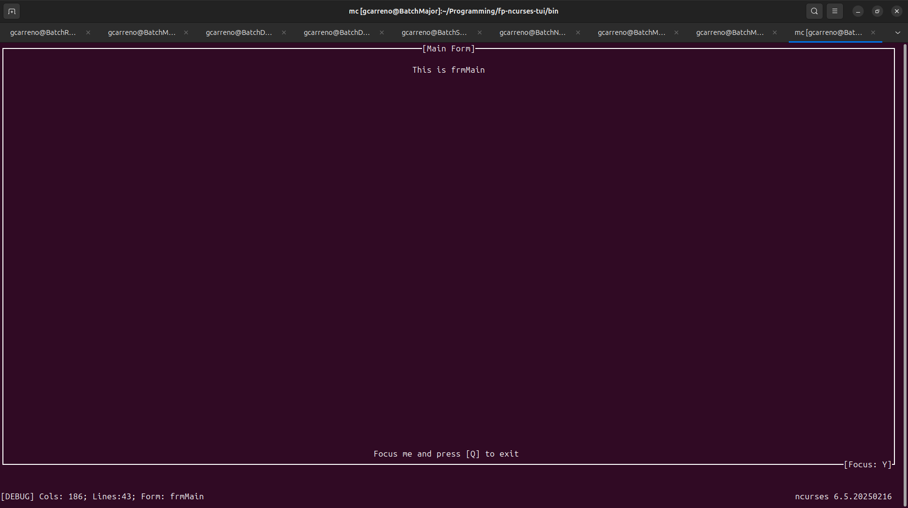
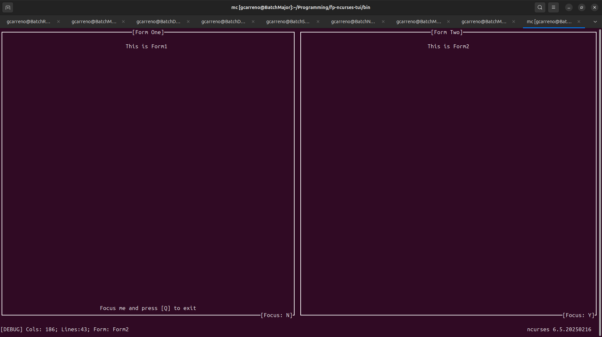
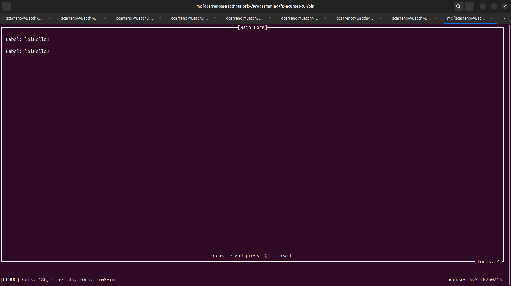
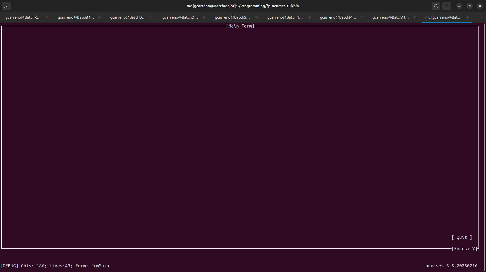

# Free Pascal `ncurses` wrapper

This is an attempt to recreate, as much as possible, the pattern used in the `LCL` but instead of a graphic environment, we wrap the well known `ncurses` lib.

## Screen Shots
**One Form**

**Two Forms**

**Component Label**

**Component Button**
